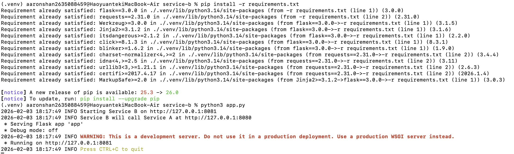
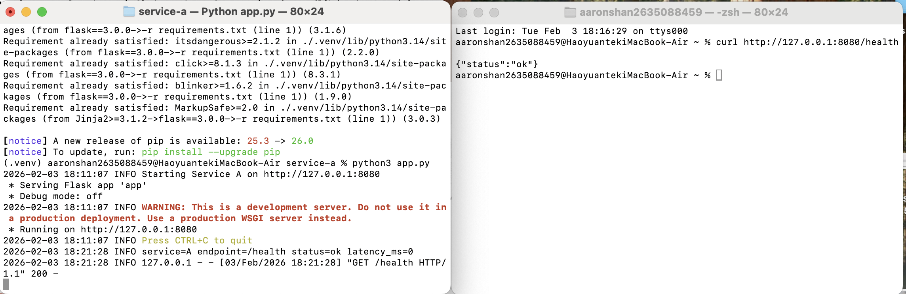
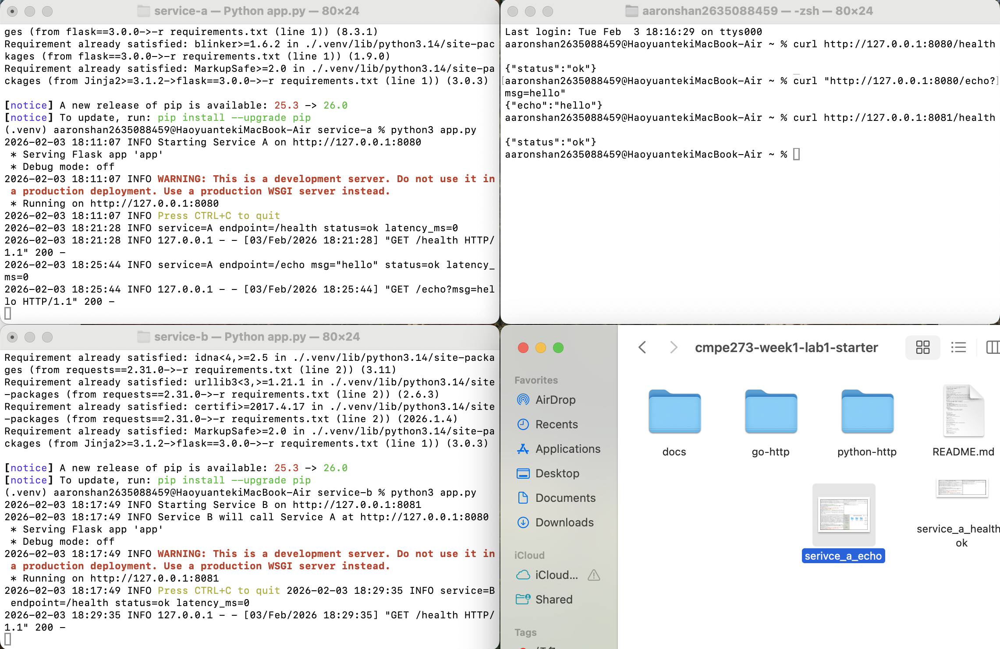
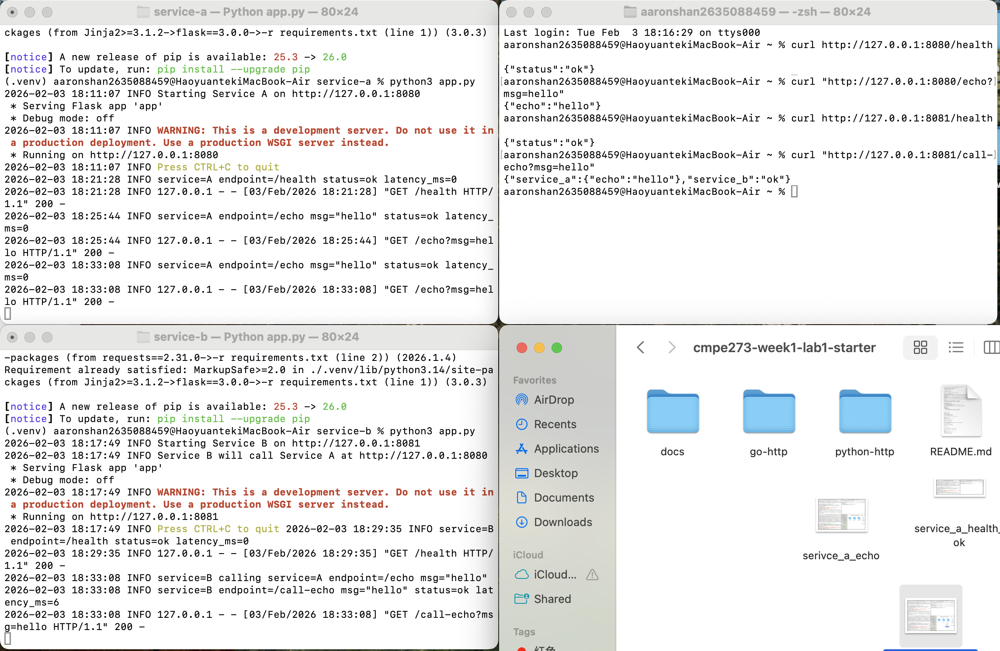
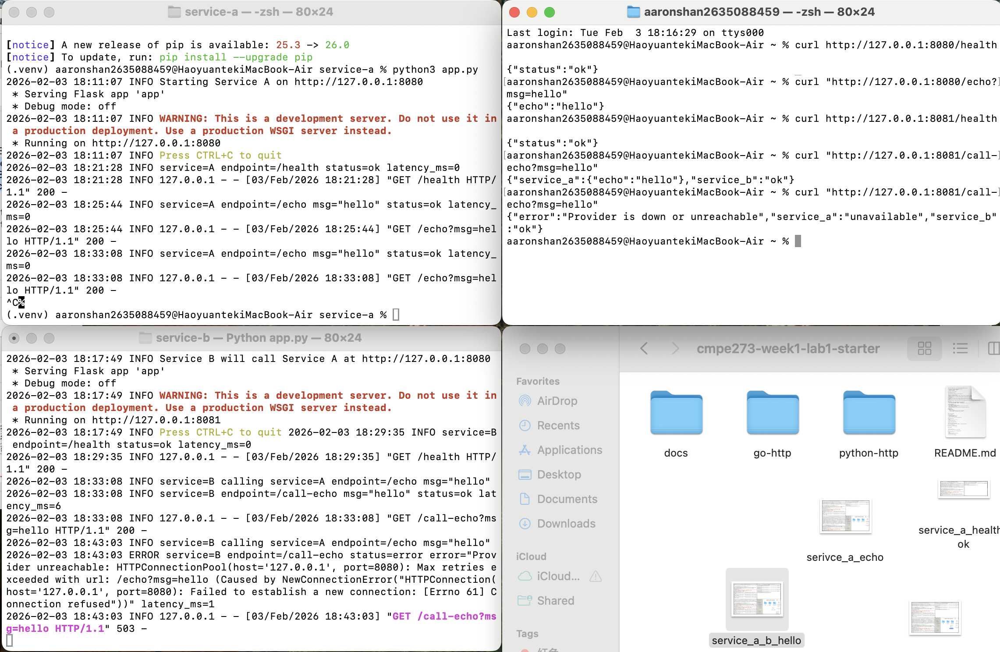

# CMPE 273 – Week 1 Lab 1: Your First Distributed System (Starter)
# Haoyuan Shan (Aaron) ID: 015631382


This starter provides two implementation tracks:
- `python-http/` (Flask + requests)
- `go-http/` (net/http)

Pick **one** track for Week 1.

## Implementation Choice

**Selected Track: Python HTTP (Flask + requests)**
---

## Code Improvements

After reviewing the starter code, I found it was already pretty complete and functional. The basic structure was solid - both services could run, communicate, and handle requests properly. 

### What I Changed:

**1. Better Log Format**
- Added timestamp format and log levels to the logging configuration
- Before: `format="%(asctime)s %(message)s"`
- After: `format="%(asctime)s %(levelname)s %(message)s"` with date format
- Why: Makes it easier to track when things happen and see error vs info messages

**2. More Specific Error Handling in Service B**
- Split the generic `Exception` catch into specific error types
- Now catches `ConnectionError`, `Timeout`, and `RequestException` separately
- Why: Different errors need different responses. Connection refused means service is down, timeout means it's too slow. This makes debugging much easier.

**3. Improved Logging Messages**
- Added startup messages showing which ports services are running on
- Service B now logs before calling Service A
- Added message content to logs (what was sent/received)
- Why: When things go wrong, you want to see exactly what happened step by step

**4. Changed Error Logs to ERROR Level**
- Used `logging.error()` instead of `logging.info()` for failures
- Why: Errors should stand out. Makes it obvious when something went wrong


## Lab Goal
Build **two services** that communicate over the network:
- **Service A** (port 8080): `/health`, `/echo?msg=...`
- **Service B** (port 8081): `/health`, `/call-echo?msg=...` calls Service A

Minimum requirements:
- Two independent processes
- HTTP (or gRPC if you choose stretch)
- Basic logging per request (service name, endpoint, status, latency)
- Timeout handling in Service B
- Demonstrate independent failure (stop A; B returns 503 and logs error)

## Deliverables
1. Repo link
2. README updates:
   - how to run locally
   - success + failure proof (curl output or screenshot)
   - 1 short paragraph: "What makes this distributed?"

---

## How to Run Locally

### Prerequisites
- Python 3.10 or higher
- pip (Python package installer)
- macOS/Linux/Windows terminal

### Step 1: Start Service A (Provider/Echo API)

Open **Terminal 1**:
```bash
# Navigate to Service A directory
cd python-http/service-a

# Create virtual environment
python3 -m venv .venv

# Activate virtual environment
source .venv/bin/activate  # On Windows: .venv\Scripts\activate

# Install dependencies
pip install -r requirements.txt

# Start Service A on port 8080
python app.py
```

**Expected Output:**


### Step 2: Start Service B (Consumer/Client)

Open **Terminal 2**:
```bash
# Navigate to Service B directory
cd python-http/service-b

# Create virtual environment
python3 -m venv .venv

# Activate virtual environment
source .venv/bin/activate  # On Windows: .venv\Scripts\activate

# Install dependencies
pip install -r requirements.txt

# Start Service B on port 8081
python app.py
```

**Expected Output:**


### Step 3: Test the System

Open **Terminal 3** for testing commands.

---

## Success + Failure Proof

### Success Scenario (Both Services Running)

**Test 1: Service A Health Check**
```bash
$ curl http://127.0.0.1:8080/health
{"status":"ok"}
```



**Test 2: Service A Echo Endpoint**
```bash
$ curl "http://127.0.0.1:8080/echo?msg=hello"
{"echo":"hello"}
```


**Test 3: Service B Health Check**
```bash
$ curl http://127.0.0.1:8081/health
{"status":"ok"}
```



**Test 4: Service B Calls Service A (Network Communication)**
```bash
$ curl "http://127.0.0.1:8081/call-echo?msg=hello"
{"service_a":{"echo":"hello"},"service_b":"ok"}
```



---

### ❌ Failure Scenario (Service A Stopped - Independent Failure)

**Step 1:** Stop Service A by pressing `Ctrl+C` in Terminal 1

**Step 2:** Test Service B again:
```bash
$ curl "http://127.0.0.1:8081/call-echo?msg=hello"
{"error":"Provider is down or unreachable","service_a":"unavailable","service_b":"ok"}
```



**HTTP Status Code:** `503 Service Unavailable`

**Service B Error Logs:**
```
2026-02-03 18:43:03 INFO service=B calling service=A endpoint=/echo msg="hello"
2026-02-03 18:43:03 ERROR service=B endpoint=/call-echo status=error error="Provider unreachable: HTTPConnectionPool(host='127.0.0.1', port=8080): Max retries exceeded with url: /echo?msg=hello (Caused by NewConnectionError("HTTPConnection(host='127.0.0.1', port=8080): Failed to establish a new connection: [Errno 61] Connection refused"))" latency_ms=1
2026-02-03 18:43:03 INFO 127.0.0.1 - - [03/Feb/2026 18:43:03] "GET /call-echo?msg=hello HTTP/1.1" 503 -
```

**Key Observations:**
-  Service B continues to run even when Service A is down
-  Service B returns HTTP 503 status code
-  Service B logs detailed error information with ERROR level
- Service B provides user-friendly error message

---

### Timeout Test (Verifies 1-second timeout works)

This test demonstrates that Service B has a 1-second timeout when calling Service A.

**Setup:** add a delay in Service A to simulate a slow response:

In `service-a/app.py`, add `time.sleep(5)` in the echo function:
```python
@app.get("/echo")
def echo():
    start = time.time()
    msg = request.args.get("msg", "")
    
    # add delay to test timeout
    time.sleep(5)  # 5 seconds - exceeds 1 second timeout
    
    resp = {"echo": msg}
    # ... rest of code
```

**Test:**
```bash
$ curl "http://127.0.0.1:8081/call-echo?msg=hello"
{"error":"Request timed out","service_a":"unavailable","service_b":"ok"}
```


**Service B Logs:**
```
2026-02-03 19:19:41 INFO service=B calling service=A endpoint=/echo msg="hello"
2026-02-03 19:19:41 ERROR service=B endpoint=/call-echo status=error error="Request timeout: HTTPConnectionPool(host='127.0.0.1', port=8080): Read timed out. (read timeout=1.0)" latency_ms=1003
```

** IMPORTANT:** After testing, **remove or comment out** the `time.sleep(5)` line

**Why remove it:**
- The 5-second delay will make ALL requests slow
- Every call to Service A will timeout
- Normal functionality will be broken
- Users will always see timeout errors

The delay was only for testing. In production, Service A should respond quickly. The timeout exists to handle cases where the network is slow or Service A has real performance issues, not artificial delays.

---

## What Makes This Distributed?

This system is distributed because Service A and Service B are **two independent processes** running with separate memory spaces that communicate over the **network using HTTP protocol**. Even though both services run on localhost, they interact through the network stack (TCP/IP) rather than direct function calls. Each service can be started, stopped, or fail independently without affecting the other's ability to run. When Service A becomes unavailable, Service B gracefully handles the failure by catching network errors, logging detailed error messages, and returning appropriate HTTP 503 responses to clients. This shows core distributed system characteristics: **process independence**, **network-based communication**, **loose coupling**, and **fault tolerance**. The architecture also allows for future deployment on separate physical machines simply by changing the network address, without requiring code modifications.

---

## Understanding Scenarios

**What happens on timeout?**
When Service A takes longer than 1 second to respond, Service B's timeout kicks in. The `requests` library throws a `Timeout` exception, which my code catches specifically. Service B then logs an ERROR message showing "Request timeout" with the full error details and returns a 503 status to the client. The timeout prevents Service B from hanging indefinitely - it fails fast and gives the user a clear error message instead of waiting forever.

**What happens if Service A is down?**
If Service A isn't running, the connection to port 8080 gets refused immediately. This triggers a `ConnectionError` exception in Service B. My code catches this separately from timeouts and logs it as "Provider unreachable" with ERROR level. Service B stays running and returns a 503 with a user-friendly message. The key point is Service B doesn't crash - it handles the failure gracefully.

**How do logs help with debugging?**
My logs show four main things: service name, endpoint, status, and latency. When something breaks, I check the logs to see exactly where the request failed. For example, if I see "service=B calling service=A" followed by an ERROR, I know the problem happened during the network call, not in Service B's code. The latency also helps - if I see `latency_ms=1003` on a timeout, that confirms it waited the full 1 second. For debugging, I'd start by checking if both services are running, then look at the logs to see which service reported an error and what type of error it was.
